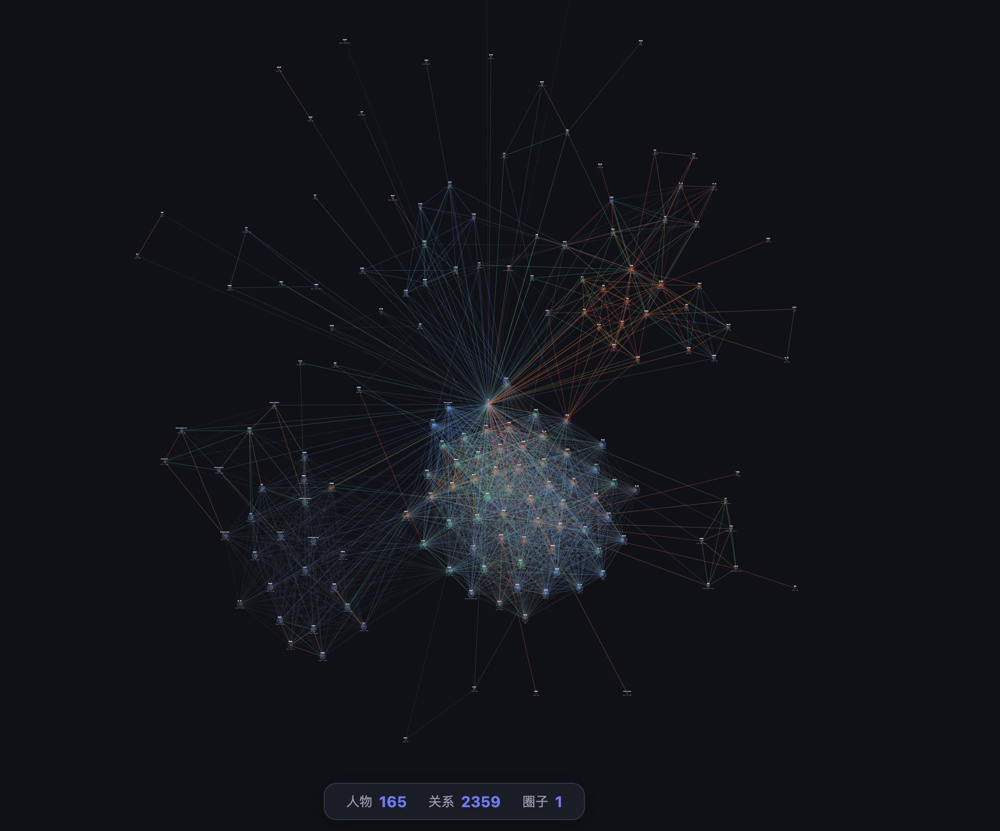

# SocialNet

A single-file, local-first social network visualization tool built with D3.js.

## Features

- **Force-directed graph** — nodes for people, edges for relationships, centered on "me"
- **Familiarity levels** — color-coded nodes/edges (密友, 熟悉, 一般, 不太熟, 只见过, 没见过, unknown)
- **Custom tags** — relation tags (同学, 同事, ...), contact methods, personal info; all customizable and persistent
- **Transitivity** — define transitive relations (e.g. 高中同学's 高中同学 = 高中同学), auto-propagate connections
- **Proximity ranking** — Random Walk with Restart (closed-form) to rank how close each person is to you
- **Relation path finder** — BFS shortest path between any two people with visual display
- **Batch operations** — connect one person to all people with a certain tag; batch-set unknown familiarity levels
- **File persistence** — bind to a local JSON file via File System Access API; auto-saves on every change
- **Import/Export** — JSON import/export for backup and portability

## Usage

Just open `index.html` in a modern browser (Chrome/Edge recommended for File System Access API support). No server or build step required.

## Data Storage

- **localStorage** — graph data, custom tags, and transitive settings are saved automatically
- **Local file binding** — optionally bind to a `.json` file for durable persistence across browser resets

Your data never leaves your machine.

## Tech

Single HTML file, zero build dependencies. Uses [D3.js v7](https://d3js.org/) loaded from CDN.
